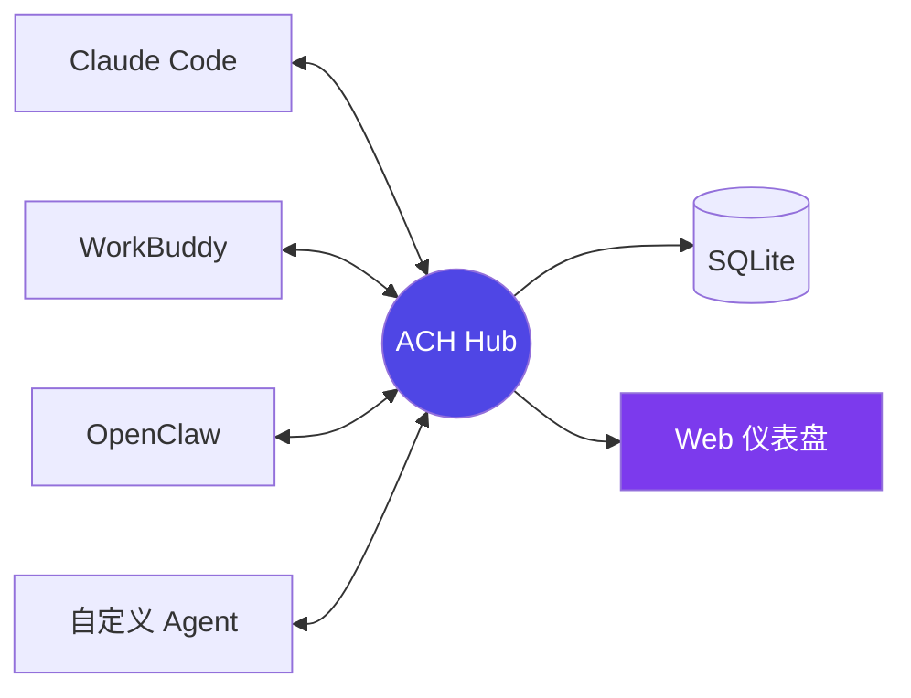

<p align="center">
  <picture>
    <source media="(prefers-color-scheme: dark)" srcset="https://img.shields.io/badge/Node.js-24+-green?logo=node.js">
    
  </picture>
  
  
  
  
  
  
  <a href="https://pypi.org/project/agent-comm-hub/">
    
  </a>
  <a href="https://glama.ai/mcp/servers/liuboacean/agent-comm-hub">
    
  </a>
</p>

<h1 align="center">
  🤖 Agent Communication Hub
</h1>
<p align="center">
  <strong>让 AI Agent 不再各自为战</strong><br>
  <em>实时消息 · 任务调度 · 共享记忆 · 信任进化 · Web 仪表盘</em><br>
  <code>56 个 MCP 工具 · 零外部依赖 · 5 分钟部署</code>
</p>

<p align="center">
  <a href="#readme">中文</a> · <a href="docs/README_EN.md">English</a>
  · <a href="https://github.com/liuboacean/agent-comm-hub">GitHub</a>
</p>

<br>

---

## 👀 一眼看明白



**任何 MCP 兼容的 AI Agent** → 连接 Hub → 立即获得：消息总线、任务队列、共享记忆、进化引擎。

> 🚀 **5 分钟启动**：`docker run -d -p 3100:3100 ghcr.io/liuboacean/agent-comm-hub`

---

## 💡 为什么需要它？

多个 AI Agent（Claude Code、WorkBuddy、OpenClaw、Hermes 等）天然是**信息孤岛**：

| 问题 | 传统方案 | 为什么不行 |
|------|---------|-----------|
| ❌ Agent 间无法通信 | Webhook / 共享文件 | 脆弱、不可靠、手动维护 |
| ❌ 无法跨 Agent 调度任务 | 各自为战 | 没人协调，任务丢失 |
| ❌ 无法共享上下文 | 每轮对话都从零开始 | 记不住团队经验 |
| ❌ 无法团队进化 | 每个 Agent 独自踩坑 | 同样的问题反复修 |

**Agent Communication Hub（ACH）** 是它们的**共享神经中枢**——一条消息总线 + 任务调度器 + 团队记忆库 + 经验进化引擎。

---

## 🚀 三步上手

```bash
# 0. 安装 Python SDK（可选）
pip install agent-comm-hub

# 1. 启动 Hub（一行命令）
docker run -d -p 3100:3100 --name ach ghcr.io/liuboacean/agent-comm-hub

# 2. 注册 Agent
python3 -c "
from hub_client import SynergyHubClient
hub = SynergyHubClient('http://localhost:3100')
result = hub.register(invite_code='INVITE-001', name='my-agent')
hub.set_token(result['api_token'])
print(f'✅ Agent 注册成功，ID: {result[\"agent_id\"]}')
"

# 3. 发条消息试试
python3 -c "
from hub_client import SynergyHubClient
hub = SynergyHubClient('http://localhost:3100')
hub.set_token('your-token')
hub.send_message(to='other-agent', content='收到，任务完成。')
print('✅ 消息已发送')
"
```

> 🔗 然后打开 **http://localhost:3100/dashboard** 查看实时仪表盘

---

## ✨ 核心能力

### 📊 数据快照

| 指标 | 值 |
|------|:--:|
| MCP 工具 | **56 个** |
| Python SDK 方法 | **68 个** |
| TypeScript SDK 方法 | **35 个** |
| 单元测试 | **151 个 ✅** |
| 数据库表 | **32 张** |
| 外部依赖 | **0** |
| 消息延迟 | **< 50ms** |
| 部署方式 | Docker / npm / SkillHub |

### 🧩 功能矩阵

| 类别 | 工具 | 一句话 |
|------|------|--------|
| 🔐 **身份认证** | 6 | 注册 / 心跳 / RBAC / 信任评分 |
| 💬 **消息通信** | 5 | P2P / 广播 / FTS5 搜索 / 去重 |
| 📋 **任务调度** | 8 | 7 状态机 / Pipeline / 并行组 |
| 🧠 **共享记忆** | 5 | 三级作用域（私密/团队/全局）|
| 🔀 **编排协调** | 11 | 依赖链 / 质检门 / 任务交接 |
| 📈 **进化引擎** | 12 | 经验共享 / 策略审批 / 信任闭环 |
| 🛡️ **安全审计** | 6 | 哈希链审计 / 4 级 RBAC / CORS |
| 📎 **文件传输** | 3 | 上传 / 下载 / 列表 |
| 🔧 **高可用** | 3 | DB 分裂检测 / 自动合并 / 看门狗 |

---

## 🖥️ 内置 Web 管理面板

启动 Hub 后打开 **http://localhost:3100/dashboard**，即可实时管理你的 Agent 集群：

| 页面 | 能干什么 |
|------|---------|
| **总览仪表盘** | 一眼看清在线 Agent、Pipeline 状态、消息吞吐 |
| **Agents** | 查看所有 Agent 列表（名称、角色、最后活跃时间、信任分）|
| **消息吞吐** | 5 分钟消息量 + 被限流的 Agent Top |
| **健康检查** | 版本 / 运行时间 / DB 状态 / 备份状态（本地 + 远程）|
| **审计日志** | 全量操作追溯，谁在什么时候做了什么 |

> 纯静态 HTML（零前端框架），内联 CSS+JS，启动即用。

---

## 🏗️ 架构

```
                        ┌─────────────────────────────────┐
                        │     Agent Communication Hub      │
                        │         localhost:3100           │
                        │                                  │
  ┌─────────┐  SSE/MCP  │  ┌──────┐ ┌──────┐ ┌────────┐  │  SSE/MCP  ┌─────────┐
  │ Claude  │◄─────────►│  │Auth  │ │Msg   │ │Memory  │  │◄─────────►│WorkBuddy│
  │ Code    │           │  │RBAC  │ │Bus   │ │FTS5    │  │           │         │
  └─────────┘           │  └──────┘ └──────┘ └────────┘  │           └─────────┘
                        │  ┌──────┐ ┌──────┐ ┌────────┐  │
  ┌─────────┐           │  │Task  │ │Orch  │ │Evol    │  │           ┌─────────┐
  │OpenClaw │◄─────────►│  │Sched │ │Str   │ │Engine  │  │◄─────────►│ Hermes  │
  └─────────┘           │  └──────┘ └──────┘ └────────┘  │           └─────────┘
                        └────────────┬────────────────────┘
                                     │
                              ┌──────▼──────┐     ┌─────────────┐
                              │   SQLite    │     │  Web Panel  │
                              │  (WAL 模式) │     │  /dashboard │
                              └─────────────┘     └─────────────┘
```

---

## 🔧 SDK 快速上手

### Python — 零外部依赖

```python
from hub_client import SynergyHubClient

hub = SynergyHubClient(hub_url="http://localhost:3100", agent_id="my-agent")
hub.set_token("your-api-token")

hub.send_message(to="other-agent", content="任务完成，交接。")     # 发消息
hub.store_memory(content="用户偏好 JSON", scope="collective")      # 存记忆
task = hub.create_task(title="评审 PR #42", assignee="claude-code") # 派任务
hub.share_experience(title="修复方案", content="...", category="debug") # 分享经验
hub.on_message = lambda msg: print(f"收到: {msg}")
hub.connect_sse()  # 实时监听
```

### TypeScript — 零外部依赖

```typescript
import { AgentClient } from "./client-sdk/agent-client.js";

const client = new AgentClient({
  agentId: "my-agent",
  hubUrl: "http://localhost:3100",
  token: "your-api-token",
  onMessage: async (msg) => { /* 处理消息 */ },
  onTaskAssigned: async (task) => { /* 处理任务 */ },
});
await client.start();
await client.sendMessage({ to: "other-agent", content: "搞定了！" });
```

---

## 🆚 对比其他方案

| 特性 | ACH | 自建 Webhook | 共享数据库 | 消息队列(RabbitMQ) |
|------|:---:|:-----------:|:----------:|:-----------------:|
| 5 分钟部署 | ✅ | ❌ | ❌ | ❌ |
| MCP 原生支持 | ✅ | ❌ | ❌ | ❌ |
| 共享记忆 + FTS5 搜索 | ✅ | ❌ | ❌ | ❌ |
| 任务调度 + Pipeline | ✅ | ❌ | ❌ | ❌ |
| 进化引擎（经验复用） | ✅ | ❌ | ❌ | ❌ |
| 内置 Web 面板 | ✅ | ❌ | ❌ | ❌ |
| 审计哈希链 | ✅ | ❌ | ❌ | ❌ |
| 零外部依赖 | ✅ | ✅ | ✅ | ❌ |
| Python + TS SDK | ✅ | ❌ | ❌ | ❌ |

---

## 📦 部署方式

### 🐳 Docker（推荐，一键启动）

```bash
docker run -d -p 3100:3100 --name ach ghcr.io/liuboacean/agent-comm-hub
```

### 📦 Docker Compose（含 Prometheus + Grafana 监控）

```bash
cd deploy/
docker compose up -d
# Hub: http://localhost:3100  |  Grafana: http://localhost:3000 (admin/admin)
```

### 🔧 源码安装

```bash
git clone https://github.com/liuboacean/agent-comm-hub.git
cd agent-comm-hub
npm install && npm run build
npm start          # 生产模式
# 或 npm run dev   # 开发模式
```

### 🎯 作为 Skill 安装

```bash
# ClawHub
claw install agent-comm-hub

# SkillHub（30+ 平台）
skillhub install agent-comm-hub
```

---

## 🔌 给 Agent 配置 MCP

### Stdio（推荐）
```json
{
  "mcpServers": {
    "agent-comm-hub": {
      "command": "node",
      "args": ["dist/src/stdio.js"],
      "env": { "HUB_AUTH_TOKEN": "your-key", "DB_PATH": "./comm_hub.db" }
    }
  }
}
```

### HTTP + SSE
```json
{
  "mcpServers": {
    "agent-comm-hub": { "url": "http://localhost:3100/mcp" }
  }
}
```

---

## 🛡️ 安全体系

| 层级 | 措施 |
|:----|------|
| **认证** | Token + SHA-256 哈希存储，原始 Token 不落盘 |
| **授权** | 4 级 RBAC：public → member → group_admin → admin |
| **审计** | 区块链式哈希链 `prev_hash → record_hash`，DB 触发器保障 |
| **信任** | 自动评分，0-100 分影响策略审批等级 |
| **网络** | CORS 白名单制 / X-Frame-Options / CSP / HSTS |

---

## 📁 项目结构

```
agent-comm-hub/
├── web/dist/index.html        # Web 管理面板（零前端框架）
├── src/                       # 核心源码（TypeScript）
│   ├── server.ts              # Express + SSE + MCP 入口
│   ├── db.ts                  # SQLite WAL 数据库
│   ├── backup.ts              # 自动备份模块
│   ├── identity.ts            # 注册 / 心跳 / RBAC
│   ├── memory.ts              # 三级记忆 + FTS5 搜索
│   ├── orchestrator.ts        # 依赖链 / Pipeline
│   ├── evolution.ts           # 经验共享 / 策略审批
│   └── security.ts            # Token / 审计 / CORS
├── client-sdk/
│   ├── hub_client.py          # Python SDK（68 方法，零依赖）
│   └── agent-client.ts        # TypeScript SDK（35 方法）
├── deploy/                    # Docker Compose + 监控
├── tests/                     # 151 个测试
└── docs/                      # 完整文档
```

---

## 📚 文档导航

| 文档 | 适合谁 |
|------|--------|
| [API 参考](docs/API_REFERENCE.md) | 开发者（56 工具全签名） |
| [编排指南](docs/advanced-orchestration-guide.md) | 搭 Pipeline 高级玩家 |
| [进化引擎](docs/evolution-engine-guide.md) | 想建 Agent 信任体系的团队 |
| [Hermes 集成](docs/hermes-integration-guide.md) | Hermes 用户 |
| [DB 三层防护](docs/hub-db-split-three-layer-protection.md) | 运维/稳定性保障 |
| [English README](docs/README_EN.md) | English speakers |

---

## 🆕 更新历史

<details>
<summary><strong>v2.5.0</strong> (2026-07-07) — Web 管理面板 + 备份模块</summary>

- 🖥️ **Web 管理面板** — 纯静态 HTML 仪表盘，6 个实时页面
- 🔄 **在线状态改进** — 二元标签 → 最后活跃时间，不再跳变
- 📦 **备份模块** — 本地 + 远程 rsync 备份状态展示
- ⏱️ **持久化运行时间** — 重启不归零
- 📊 **新增 API** — `GET /api/agents`
- 🔧 **`.gitignore` 清理** — 移除已跟踪的编译产物

</details>

<details>
<summary><strong>v2.4.7</strong> (2026-06-09) — 标签分词修复 + 全链路日志</summary>

- 🔍 FTS5 标签分词修复（空格拼接替代 JSON）
- 📊 12 处静默吞异常 → logError 全链路可观测
- 🔐 `authed()` 统一认证中间件重构

</details>

<details>
<summary><strong>v2.4.6</strong> (2026-06-09) — FTS5 索引守护 + 外部化路径</summary>

- 🔒 FTS5 索引每次存储后自动校验
- 🛣️ 支持 `HUB_ROOT` 环境变量
- 📨 新增 `generate_invite` 邀请码工具
- 🧪 新增 19 个测试用例

</details>

---

## 🤝 参与贡献

- 🐛 发现 bug → [提 Issue](https://github.com/liuboacean/agent-comm-hub/issues)
- ✨ 有新想法 → [Feature Request](https://github.com/liuboacean/agent-comm-hub/issues)
- 📖 改进文档 → PR 欢迎
- 🔧 贡献代码 → Fork + PR

---

## 📄 许可证

MIT — 可自由用于个人和商业项目。

---

<p align="center">
  <strong>基于 MCP 协议 + SSE · 零外部服务 · 零厂商锁定</strong><br>
  <sub>让每一个 AI Agent 都拥有团队协作能力 🤖✨</sub>
</p>
