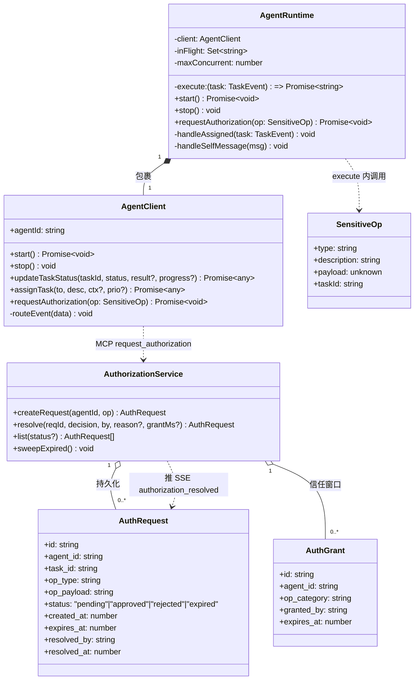
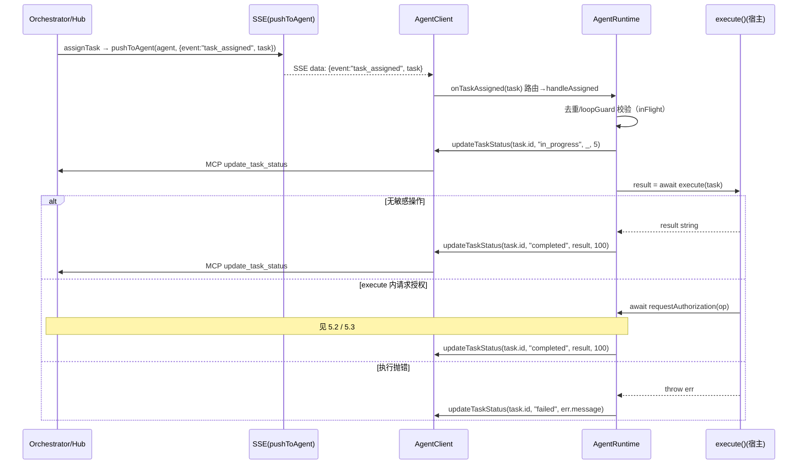
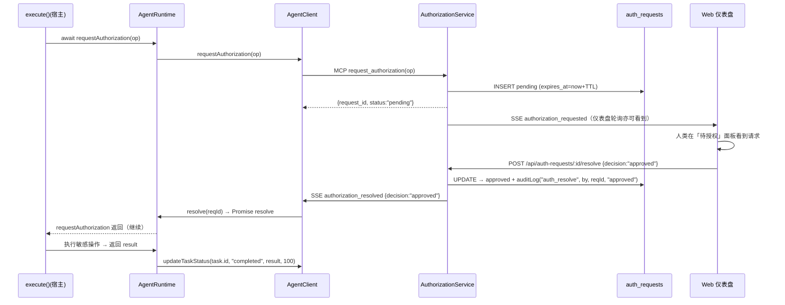
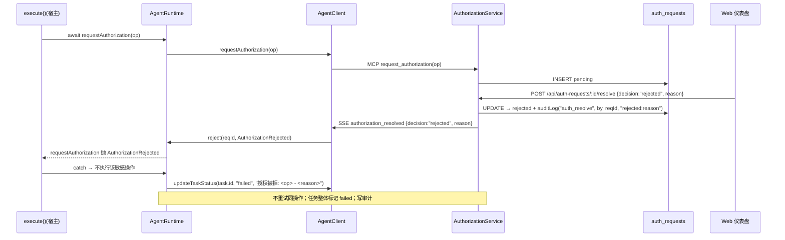
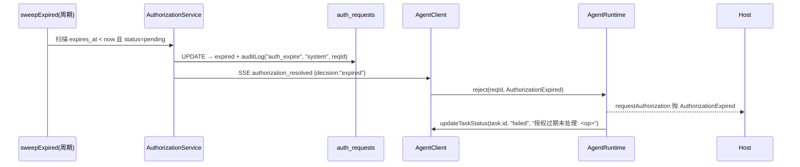
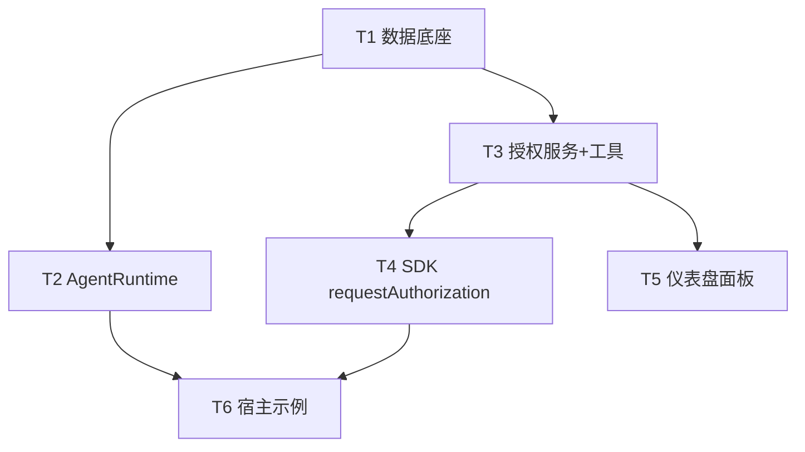

# ACH 增量架构设计：自主 Agent 执行闭环 + 操作级人在环授权队列

> 版本：设计稿 v1（design only，待用户确认后交付工程师实现）
> 仓库：`agent-comm-hub`（当前 v3.0.23，TS + better-sqlite3 + SSE + Express + MUI 前端，零外部服务）
> 设计依据：已逐项核对真实代码（`client-sdk/agent-client.ts`、`src/orchestrator.ts`、`src/sse.ts`、`src/tools.ts`、`src/db.ts`、`src/security.ts`、`web/src/App.tsx`、`client-sdk/*-integration.ts`）。

---

## 1. TL;DR

> **在客户端 SDK 新增一个运行时原语 `AgentRuntime`（包裹现有 `AgentClient`），让 Agent 收到任务后自动「标记进行中 → 执行宿主注入的 `execute()` → 回写完成/失败」，从而消灭人工中转；同时新增一条「操作级授权」闭环——Agent 执行中遇到敏感操作就调 `requestAuthorization(op)` 挂起等待，用户在 Web 仪表盘「待授权」面板批准/拒绝，Hub 经 SSE 把结果回推，Agent 继续或优雅中止。Hub 始终只是纯协调层，零新增依赖。**

两条特性正交：Feature A 解决「收到任务后是否自主执行」，Feature B 解决「执行中敏感操作是否放行」。Feature B 通过 `AgentRuntime` 暴露的 `requestAuthorization()` 接入 Feature A 的 `execute()`。

---

## 2. 实现方案 + 框架选型

### 2.1 总体原则（增量、零新依赖）

| 维度 | 现状（已具备） | 本次增量 | 是否引入新依赖 |
|---|---|---|---|
| 传输层 | `AgentClient` SSE 长连接 + 自动重连，`pushToAgent` 实时推 | 复用；仅新增 2 个事件类型 | 否 |
| 任务状态机 | `orchestrator.ts` `assigned→in_progress→completed/failed` | 复用，`AgentRuntime` 只驱动既有转换 | 否 |
| 工具层 | `server.tool(name, desc, zodSchema, authed(...))` | 新增 2 个 MCP 工具（注册即接入） | 否（复用 zod） |
| 持久化 | `better-sqlite3` + `CREATE TABLE IF NOT EXISTS` 迁移 | 新增 `auth_requests`(+可选`auth_grants`) 表 | 否 |
| 审计 | `auditLog()` 哈希链（`prev_hash`/`record_hash`） | 授权创建/决议写入同一条链 | 否 |
| 鉴权 | 4 级 RBAC + 激活态鉴权 | 复用；决议动作走仪表盘登录态 | 否 |
| 前端 | React + MUI + react-router（`App.tsx` 路由） | 新增 `AuthQueue.tsx` 路由 + 2 个 REST 端点 | 否（复用 MUI/react-router） |

**结论：零新增第三方依赖。** 所有能力均建立在既有原语之上。

### 2.2 Feature A — 自主执行闭环（落点拍板：SDK 原语）

- **落点：在 `client-sdk` 新增 `AgentRuntime` 运行时原语**，包裹现有 `AgentClient`。
  - 监听 `onTaskAssigned` → 自动 `updateTaskStatus(in_progress)` → 调宿主注入的 `execute(task)` → `updateTaskStatus(completed, {result})`（异常→`failed`）。
  - `new_message` 指向自己时触发可选 `onSelfMessage` 反应。
  - `execute()` 由宿主实现（WorkBuddy/Hermes 各自注入），Hub 完全不感知执行内容——**Hub 仍是纯协调层**。
- **为何 SDK 原语而非各宿主自实现**：
  1. 闭环里最容易出错的「状态机驱动、幂等去重、崩溃恢复、并发上限、防自杀式循环、授权挂起/超时」等护栏是**通用逻辑**，放一处即可被所有宿主复用，避免 WorkBuddy/Hermes 各写一套导致行为不一致。
  2. **多宿主兼容**：任何新宿主只要 `new AgentRuntime(client, execute)` 一行即可获得自主执行能力；Hub 端零改动。
  3. 现有 `workbuddy-integration.ts` / `hermes-integration.ts` 已经在 `onTaskAssigned` 里手写这套闭环（见代码第 19–37 / 36–60 行），证明模式成立——本次只是把它抽成可复用原语，并补上缺失的护栏。

### 2.3 Feature B — 操作级人在环授权队列（落点拍板：Hub 侧服务 + SDK 客户端方法）

- **Hub 侧**：新增 `src/authorization.ts` 服务（建表/建请求/决议/过期清扫）+ `src/tools/authorization.ts` 注册 `request_authorization` / `resolve_authorization`(可选 MCP) 工具 + `server.ts` 新增 2 个 REST 端点（供仪表盘）。
- **SDK 侧**：`AgentClient` 新增 `requestAuthorization(op)`，返回 `Promise`；`routeEvent` 新增 `authorization_requested` / `authorization_resolved` 两个分支，用 `reqId→{resolve,reject}` 映射表 resolve/reject 该 Promise；内置 TTL 超时 reject。
- **仪表盘侧**：`web/src/components/AuthQueue.tsx` 新面板，轮询 `GET /api/auth-requests?status=pending`，按钮调 `POST /api/auth-requests/:id/resolve`。
- **关键点**：授权是「操作级、本次具体敏感操作批不批」，与既有「角色级 RBAC」互补——RBAC 管“你能不能调这类工具”，授权队列管“你这次要做的这件具体事放不放行”。

---

## 3. 文件清单（新增 / 修改，相对仓库根）

### Feature A
| 操作 | 路径 | 说明 |
|---|---|---|
| 新增 | `client-sdk/runtime.ts` | `AgentRuntime` 类 + `runAutonomousLoop()` 工厂 + 循环护栏/崩溃恢复 |
| 修改 | `client-sdk/agent-client.ts` | 新增 `requestAuthorization(op)` 方法；`routeEvent` 增加 `authorization_resolved` 分支（用于解锁 Promise）；`TaskEvent` 字段对齐 |
| 修改（示例） | `client-sdk/workbuddy-integration.ts` | 用 `AgentRuntime` 改写 `onTaskAssigned`（注入 `executeWorkBuddyTask`） |
| 修改（示例） | `client-sdk/hermes-integration.ts` | 同上，注入 `executeHermesTask` |

### Feature B
| 操作 | 路径 | 说明 |
|---|---|---|
| 新增 | `src/authorization.ts` | 授权服务：建请求 / 决议 / 过期清扫 / 信任窗口(`auth_grants`) |
| 新增 | `src/tools/authorization.ts` | 注册 `request_authorization` / `resolve_authorization` / `list_authorization_requests` |
| 修改 | `src/tools.ts` | `registerTools` 增加 `registerAuthorizationTools(...)` |
| 修改 | `src/db.ts` | 新增 `auth_requests`（+可选 `auth_grants`）建表与迁移 |
| 修改 | `src/server.ts` | 新增 REST：`GET /api/auth-requests`、`POST /api/auth-requests/:id/resolve`；SSE 推 `authorization_requested`/`authorization_resolved` |
| 修改 | `client-sdk/agent-client.ts` | `requestAuthorization()` + `routeEvent` 的 `authorization_requested`/`authorization_resolved` 分支 + Promise 映射 |
| 新增 | `web/src/components/AuthQueue.tsx` | 「待授权」面板（列表 + 批准/拒绝 + 信任窗口勾选） |
| 修改 | `web/src/App.tsx` | 增加 `/auth` 路由与侧边栏入口 |
| 修改 | `web/src/api.ts` | 增加 `fetchAuthRequests()` / `resolveAuthRequest()` |

### 共享
| 修改 | `src/config`(见 `server.ts` config 对象) | 新增 `AUTH_REQUEST_TTL_MS` / `AUTH_AUTO_APPROVE` / `RUNTIME_MAX_CONCURRENT` / `RUNTIME_LOOP_GUARD_MS` 等环境变量默认值 |
| 修改 | `src/db.ts`（清理项） | **建议**：将 `assignTask` 推送负载统一为 `{ event: "task_assigned", task: {...} }`（与 SSE 补发路径一致），消除 `type` vs `event` 历史不一致（见 §9 / §10）。 |

---

## 4. 数据结构与接口

### 4.1 `AgentRuntime` / `runAutonomousLoop` 接口与生命周期

```ts
// client-sdk/runtime.ts
import { AgentClient, TaskEvent } from "./agent-client.js";

/** 敏感操作描述（传入 requestAuthorization） */
export interface SensitiveOp {
  type: string;          // 操作类目，见 §4.5 共享常量 AUTH_OP_TYPES
  description: string;   // 人类可读的“将要做什么”
  payload?: unknown;     // 供人类判定的具体参数（JSON 序列化后入库）
  taskId?: string;       // 关联任务（可选）
}

export interface AgentRuntimeOptions {
  maxConcurrent?: number;            // 并发执行上限，默认 4
  requeueIncomplete?: boolean;       // 启动时重跑 in_progress/assigned 的崩溃恢复，默认 true
  loopGuard?: {                      // 防自杀式循环
    windowMs?: number;               // 相同 description 重分配的判定窗口，默认 30000
    maxIdentical?: number;           // 窗口内最多允许几次，超过则跳过，默认 2
  };
  onSelfMessage?: (msg: MessageEvent) => Promise<void>; // 指向自己的 new_message 可选反应
  onError?: (taskId: string, err: unknown) => void;
}

export class AgentRuntime {
  constructor(
    private client: AgentClient,
    private execute: (task: TaskEvent) => Promise<string>, // 宿主注入的执行逻辑
    private opts: AgentRuntimeOptions = {}
  );
  start(): Promise<void>;            // 接线 onTaskAssigned / onMessage；可选崩溃恢复重跑
  stop(): void;                      // 拒绝所有挂起的授权 Promise；停止接收
  /** 在 execute() 内部调用：提交授权请求并挂起，批准后 resolve，拒绝/过期 reject */
  requestAuthorization(op: SensitiveOp): Promise<void>;
}

/** 便捷工厂 */
export function runAutonomousLoop(
  client: AgentClient,
  execute: (task: TaskEvent) => Promise<string>,
  opts?: AgentRuntimeOptions
): AgentRuntime;
```

**生命周期（状态）**：`Idle → Starting（接线回调 + 崩溃恢复）→ Running（监听 task_assigned/new_message）→ Stopping（拒绝挂起 Promise）→ Stopped`。

**`handleAssigned(task)` 内部流程（护栏）**：
1. 若 `task.id` 已在 `inFlight` 集合 → 跳过（幂等去重，防止实时推 + 补发重复执行）。
2. 若 `loopGuard` 命中（窗口内相同 `description` 重分配超阈值）→ 跳过并 `auditLog('loop_guard_skip', agentId, task.id)`。
3. 标记 `in_progress`（progress 5）；写入 `inFlight`。
4. `try { result = await execute(task) }`：
   - 成功 → `updateTaskStatus(completed, result, 100)`。
   - 捕获 `AuthorizationRejected` / `AuthorizationExpired` → `updateTaskStatus(failed, "授权被拒/过期: <op>")` + `auditLog`。
   - 其他异常 → `updateTaskStatus(failed, err.message)`。
5. 从 `inFlight` 移除；若 `inFlight.size >= maxConcurrent` 则不主动拉取更多（Hub 补发/重分配自然节流）。

### 4.2 `auth_requests` 表 Schema（SQL DDL）

```sql
-- src/db.ts 内新增（CREATE TABLE IF NOT EXISTS，幂等）
CREATE TABLE IF NOT EXISTS auth_requests (
  id              TEXT PRIMARY KEY,                 -- req_<timestamp>_<rand>
  agent_id        TEXT NOT NULL,                    -- 请求方 Agent
  task_id         TEXT,                             -- 关联任务（可空）
  op_type         TEXT NOT NULL,                    -- 见 AUTH_OP_TYPES
  op_payload      TEXT,                             -- JSON：具体操作参数，供人类判定
  status          TEXT NOT NULL DEFAULT 'pending',  -- pending|approved|rejected|expired
  created_at      INTEGER NOT NULL,
  expires_at      INTEGER NOT NULL,                 -- created_at + AUTH_REQUEST_TTL_MS
  resolved_by     TEXT,                             -- 决议人（人类操作者 ID / admin）
  resolved_at     INTEGER,
  decision_reason TEXT
);
CREATE INDEX IF NOT EXISTS idx_auth_status ON auth_requests(status);
CREATE INDEX IF NOT EXISTS idx_auth_agent  ON auth_requests(agent_id);

-- 可选：信任窗口（时间窗口信任粒度，见 §9 决策 3）
CREATE TABLE IF NOT EXISTS auth_grants (
  id          TEXT PRIMARY KEY,
  agent_id    TEXT NOT NULL,
  op_category TEXT NOT NULL,                        -- 类目级信任（如 'external_api'）
  granted_by  TEXT NOT NULL,
  granted_at  INTEGER NOT NULL,
  expires_at  INTEGER NOT NULL
);
CREATE INDEX IF NOT EXISTS idx_grant_agent_cat ON auth_grants(agent_id, op_category);
```

### 4.3 新增 MCP 工具参数 / 返回 Schema

**`request_authorization`**（Agent 经 SDK 调用；`agent_id` 取自 `authed` 上下文）

```
入参 (zod):
  op_type     : enum(AUTH_OP_TYPES)        // 必填，操作类目
  description : string                     // 必填，人类可读
  op_payload  : string (JSON).optional()   // 具体参数
  task_id     : string.optional()
出参:
  { request_id: string, status: "pending" | "approved", decision?: "approved" }
说明: 默认创建 pending 行并推 authorization_requested；
      若开启 AUTH_AUTO_APPROVE 且存在有效 auth_grant 或信任分阈值命中，则直接 approved
      并推 authorization_resolved（SDK Promise 立即 resolve）。
```

**`resolve_authorization`**（MCP 版，admin 可选；主路径为 REST，见 §4.4）

```
入参 (zod):
  request_id : string
  decision   : enum("approved","rejected")
  reason     : string.optional()
  grant_window_ms?: number   // 若批准且填此值 → 建 auth_grants 信任窗口（决策 3 高级项）
出参:
  { request_id, status, decision }
```

**`list_authorization_requests`**（仪表盘/调试用，可选）

```
入参: status?: enum("pending","approved","rejected","expired")
出参: { requests: AuthRequest[] }
```

### 4.4 仪表盘 REST 端点（人类操作者主路径）

| 方法 | 路径 | 说明 | 鉴权 |
|---|---|---|---|
| `GET` | `/api/auth-requests?status=pending` | 列出待授权（仪表盘轮询，3–5s 一次） | 仪表盘登录态 |
| `POST` | `/api/auth-requests/:id/resolve` | 批准/拒绝；body `{decision, reason?, grant_window_ms?}` | 仪表盘登录态 |

> 注：仪表盘是浏览器，非 Agent，因此不走 `/events/:agent_id` SSE，采用 REST 轮询（人类 UI 可接受；零轮询约束仅针对 Agent↔Hub）。`authorization_resolved` 仍经 SSE 回推**请求方 Agent** 以解锁其 Promise。

### 4.5 新增 SSE 事件 Payload 结构

```ts
// authorization_requested —— 推给请求方 Agent（透明记录“已挂起”），仪表盘经 REST 轮询获取
{
  event: "authorization_requested",
  request: {
    id: string; agent_id: string; task_id?: string;
    op_type: string; op_payload?: unknown;
    status: "pending"; created_at: number; expires_at: number;
  }
}

// authorization_resolved —— 推给请求方 Agent（解锁 Promise；必填）
{
  event: "authorization_resolved",
  request_id: string; agent_id: string; task_id?: string;
  decision: "approved" | "rejected" | "expired";
  reason?: string;
}
```

### 4.6 类图（Mermaid）



---

## 5. 程序调用流程（时序图）

### 5.1 自主 loop 执行流（task_assigned → in_progress → execute → completed）



### 5.2 授权请求 → 批准 → 回推（Agent 继续）



### 5.3 授权被拒流（Agent 优雅中止）



### 5.4 授权过期流（默认失败即拒绝）



---

## 6. 任务列表（有序、依赖、按 Feature 分组）

实现顺序遵循「先 Hub 数据底座 → 再 SDK 原语 → 再接线 → 最后前端」。Feature A 与 Feature B 在第 1 步（数据/事件底座）之后可并行推进。

| ID | 任务 | Feature | 源文件 | 依赖 | 优先级 |
|---|---|---|---|---|---|
| **T1** | 数据底座：新增 `auth_requests`(+`auth_grants`) 表与迁移；统一 `task_assigned` 推送为 `{event, task}`（清理 `type`/`event` 不一致）；补充 config 默认值 | 共享/Hub | `src/db.ts`, `src/orchestrator.ts`, `src/server.ts`(config) | — | P0 |
| **T2** | Feature A — SDK 运行时原语：`AgentRuntime` + `runAutonomousLoop`，含并发上限、inFlight 去重、崩溃恢复重跑、loopGuard 防自杀循环、可选 `onSelfMessage` | A / SDK | `client-sdk/runtime.ts` | T1（依赖一致事件契约） | P0 |
| **T3** | Feature B — Hub 授权服务 + MCP 工具：`src/authorization.ts` 服务（建/决/清扫/信任窗口）、`src/tools/authorization.ts` 注册 `request_authorization`/`resolve_authorization`/`list_authorization_requests`、`registerTools` 接线 | B / Hub | `src/authorization.ts`, `src/tools/authorization.ts`, `src/tools.ts` | T1 | P0 |
| **T4** | Feature B — SDK 客户端方法：`AgentClient.requestAuthorization(op)`（Promise + TTL 超时 reject）、`routeEvent` 新增 `authorization_requested`/`authorization_resolved` 分支与 `reqId→{resolve,reject}` 映射 | B / SDK | `client-sdk/agent-client.ts` | T3（依赖工具契约） | P0 |
| **T5** | Feature B — Web 仪表盘「待授权」面板：`server.ts` 新增 REST（`GET /api/auth-requests`、`POST /api/auth-requests/:id/resolve`，走登录态）、`AuthQueue.tsx` + `App.tsx` 路由 + `api.ts` 助手 | B / Web | `src/server.ts`, `web/src/components/AuthQueue.tsx`, `web/src/App.tsx`, `web/src/api.ts` | T3 | P1 |
| **T6** | Feature A — 宿主示例改造：用 `AgentRuntime` 重写 `workbuddy-integration.ts` / `hermes-integration.ts`（注入各自 `execute`，演示 `requestAuthorization` 用法） | A / 示例 | `client-sdk/workbuddy-integration.ts`, `client-sdk/hermes-integration.ts` | T2, T4 | P2（示例，非阻塞） |

**依赖图**：



---

## 7. 依赖包列表

**目标：零新增依赖。** 全部复用既有栈：

| 包 | 用途 | 状态 |
|---|---|---|
| `zod` | MCP 工具入参校验（T3） | 已存在 |
| `better-sqlite3` | `auth_requests` 持久化（T1） | 已存在 |
| `@modelcontextprotocol/sdk` | MCP 工具注册（T3） | 已存在 |
| `express` | REST 端点（T5） | 已存在 |
| `@mui/material` / `react-router-dom` | 仪表盘面板（T5） | 已存在 |
| `eventsource` | Node 端 SSE（仅 Hermes 回退，已存在） | 已存在 |

无任何 `npm install` 新增。

---

## 8. 共享知识（跨文件约定）

1. **SSE 事件命名规范**：payload 顶层用 `event` 字段（snake_case），`routeEvent` 按 `data.event` 分支；所有 payload 自动附带 `_hub_event_id`（全局单调 seq）用于去重/重连补发（由 `pushToAgent` 统一注入，无需各模块处理）。
2. **授权状态枚举**（Hub 与 SDK 必须一致）：`pending | approved | rejected | expired`。SDK 侧 `requestAuthorization` 的 Promise：仅 `approved` resolve；`rejected`/`expired` reject（分别抛 `AuthorizationRejected` / `AuthorizationExpired`）。
3. **操作类目常量 `AUTH_OP_TYPES`**（Hub 与 SDK 共享一份定义，建议置于 `client-sdk/types.ts` 与 `src/authorization.ts` 同步）：如 `delete_data` / `external_api` / `send_external_email` / `paid_api` / `cross_agent_delete` / `schema_change` / `revoke_token` / `cancel_task`。
4. **审计哈希链挂授权决策**：每次「建请求」「决议」「过期」均调 `auditLog(action, agentId, target, details)`：
   - `auditLog("auth_request", agentId, request_id, op_type)`
   - `auditLog("auth_resolve", resolved_by, request_id, decision + "|" + reason)`
   - `auditLog("auth_expire", "system", request_id, op_type)`
   这样授权决策被锚定进既有防篡改哈希链（`prev_hash`/`record_hash`），可供事后溯源。
5. **授权 TTL 与环境变量**：`AUTH_REQUEST_TTL_MS`（默认 `600000`=10min）；`AUTH_AUTO_APPROVE`（默认 `false`，见 §9 决策 4）；`RUNTIME_MAX_CONCURRENT`（默认 `4`）；`RUNTIME_LOOP_GUARD_MS`（默认 `30000`）。
6. **崩溃恢复约定**：`AgentRuntime.start()` 在接线后调用 `client.getTasks('in_progress')` 与 `client.getTasks('assigned')`，对未完成的任务重新入队执行（防 Agent 崩溃后任务卡在 `in_progress`）。
7. **去重约定**：以 `task.id` 为键维护 `inFlight` 集合；同一任务因「实时推 + 重连补发」被推多次时只执行一次（状态机 `in_progress→in_progress` 非法，也会兜底抛错，故必须前置去重）。
8. **与 RBAC 的关系**：`request_authorization` 由已认证 Agent（member 即可）调用；**人类批准/拒绝**是真正的 RBAC 敏感动作，走仪表盘登录态（等同现有 `requireAdminApi`/登录守卫）；可选 MCP `resolve_authorization` 限定 admin。信任窗口 `auth_grants` 仅由人类在批准时显式授予。

---

## 9. 待明确事项（5 个产品决策 — 附推荐，需用户确认）

| # | 决策点 | 我的推荐 | 理由 |
|---|---|---|---|
| **1** | **loop 落点**：SDK 原语 vs 各宿主自实现 | **SDK 原语 `AgentRuntime`** | 闭环护栏（去重/并发/崩溃恢复/防循环/授权挂起）是通用逻辑，放一处复用，保证多宿主行为一致；Hub 零改动，符合“Hub 是纯协调层”定位。各宿主仅需注入 `execute()`。 |
| **2** | **什么算敏感操作需授权**（判定规则 + 默认清单） | **判定规则**：宿主 `execute()` 在“将产生外部副作用/不可逆写/花费/跨主体影响”前主动调 `requestAuthorization(op)`；SDK 提供 `SensitiveOpPolicy` 默认策略对象供宿主参考。**默认进队列**：`delete_data`(删记忆/消息/记忆库)、`cancel_task`、`revoke_token`、`cross_agent_delete`(删他人任务/记忆)、`send_external_email`/`external_api`(POST 类外部副作用)、`paid_api`(付费/限额)、`schema_change`(迁移/DDL)。**默认直接放行**：只读查询、Agent 间内部 `send_message`/`assign_task`、`store_memory`、`share_experience`、`recall_memory`。 | 以“外部副作用 + 不可逆 + 花费 + 跨主体”四维度判定，最贴合用户“需要我授权的操作”直觉；读与内部协作默认放行以保流畅。 |
| **3** | **授权粒度**：单次 / 同类批量信任 / 时间窗口信任 | **默认单次批准**；**时间窗口信任为可选高级项**（批准时勾选“信任该 Agent N 分钟 / 该类操作 N 分钟”→ 写 `auth_grants`）。不推荐“同类批量一次性信任”（粒度粗、易误放）。 | 单次最安全、最可解释；时间窗口满足“重复同类操作别烦我”的体验，且有明确过期边界；批量信任一旦误批风险面大。 |
| **4** | **授权超时/过期策略** | 默认 **TTL=10min**；过期 → `status=expired` + 推 `authorization_resolved(decision:"expired")`；**默认失败即拒绝（deny-by-default），不自动批准**；Agent 侧 Promise reject → 任务标记 `failed`（原因：授权过期）。提供后台 `sweepExpired` 周期清扫。 | 安全默认必须“不响应=不批准”；否则会被沉默滥用。过期仍回推事件，避免 Agent Promise 永久悬挂。 |
| **5** | **授权被拒后 Agent 行为** | **优雅中止**：`execute()` 捕获 `AuthorizationRejected` → **不执行该敏感操作** → 任务整体 `updateTaskStatus(failed, "授权被拒: <op> - <reason>")` + `auditLog`；**不自动重试同操作**；可选经 `sendMessage` 向任务发起方回报“因授权被拒未能完成”。 | 与用户“我去授权，不批就别做”一致；整体 failed 让编排层可见且可重派；不重试避免绕过人类。 |

> 上述推荐均可在 `server.ts` 的 `config` 中以环境变量覆盖（如 `AUTH_AUTO_APPROVE=true` 开启信任分快路径，但**默认关闭**以尊重用户意图）。

---

## 10. 风险与权衡

| 风险 | 说明 | 缓解 |
|---|---|---|
| **Loop 失控 / 自杀式循环** | 宿主 `execute()` 若无条件地把相同任务再 `assignTask` 给自己，会无限触发 | SDK 内置 `loopGuard`（窗口内相同 `description` 重分配超阈值即跳过并审计）；`maxConcurrent` 限流；`execute()` 为宿主代码，文档明确禁止“自指派相同任务”。Hub 侧 `rateLimiter` 对 MCP 调用兜底。 |
| **授权 DoS** | 恶意/失常 Agent 高频提交 pending 授权，淹没人类面板 | `request_authorization` 走既有 `rateLimiter`（per-agent）；仪表盘显示待办计数；TTL 自动过期；可选“同 Agent 待办超阈值自动拒绝”。 |
| **与现有 RBAC 的交互** | 角色级 RBAC 与操作级授权职责重叠/冲突 | 明确分层：RBAC 管“能不能调工具”，授权队列管“这次具体事放不放行”；`request_authorization` member 可调用，批准动作走仪表盘登录态（敏感）。信任分快路径(`AUTH_AUTO_APPROVE`)默认关闭，避免绕过人类。 |
| **`type` vs `event` 历史不一致** | `assignTask` 现推 `{type:"task_assigned", content:...}`，而 SDK `routeEvent` 按 `data.event` 分支、补发路径用 `event` 字段——存在字段名不一致隐患 | T1 中统一 `assignTask` 推送为 `{event:"task_assigned", task:{...}}`（与 SSE 补发路径一致），`AgentRuntime` 以 `TaskEvent` 契约消费；SDK 同步对齐。 |
| **Promise 悬挂 / 泄漏** | Agent 断线或 `stop()` 时，挂起的 `requestAuthorization` Promise 不回收 | `AgentRuntime.stop()` 与 `AgentClient.stop()` 拒绝所有在途 Promise；过期事件 `authorization_resolved(expired)` 保证解锁；`reqId→{resolve,reject}` 映射在决议后立即清理。 |
| **崩溃后任务卡死** | Agent 在 `in_progress` 中崩溃，任务永久停留 | `start()` 崩溃恢复：重跑 `in_progress`/`assigned` 任务（去重保护防双跑）。 |
| **多宿主并发** | 同一 Agent 在多个宿主各跑一个 `AgentRuntime` | 每个 `AgentClient` 以 `agentId` 唯一标识，SSE 单连接（重连时旧连接被替换）；`inFlight` 在单进程内，故同一 Agent 只应在一个宿主运行（文档约定；如需多实例再由 Hub 侧 agent 锁保证）。 |
| **仪表盘轮询开销** | 待授权面板每 3–5s 拉一次 | 人类 UI 量级极小（pending 通常个位数）；列表带 `status=pending` 过滤与索引；不进 Agent 零轮询约束范围。 |

---

## 附：与既有能力的接缝核对（已验证）

- `AgentClient.updateTaskStatus(taskId, "in_progress"|"completed"|"failed", result?, progress?)` —— Feature A 直接复用，状态机由 `orchestrator.ts` 校验（`assigned→in_progress→completed/failed`）。
- `pushToAgent(agentId, {event, ...})` —— Feature B 的 `authorization_resolved` 直接复用，零轮询。
- `server.tool(name, desc, zodSchema, authed(ctx, perm, async (ctx,args)=>{}))` —— Feature B 工具按此注册，权限用 `authed` 包裹。
- `auditLog(action, agentId, target?, details?)` —— 授权决策锚定进哈希链，无需新增审计表。
- React + MUI + `react-router-dom`（`App.tsx` `<Route path="audit" .../>`）—— `AuthQueue.tsx` 依同样模式新增 `/auth` 路由。
